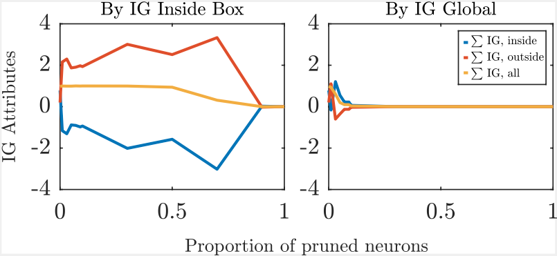

# XAI

This repository contains the implementation for the following paper


> [A Rigorous Study of Integrated Gradients Method and Extensions to Internal
Neuron Attributions](https://proceedings.mlr.press/v162/lundstrom22a/lundstrom22a.pdf), ICML 2022

The Integrated Gradeints method gives input attributions (aka saliency map) used to indicate which inputs contributed to a model output. Conductance is a method of attribuyting to internal neurons, and is based on the Integrated Gradient method. Here we present an augmentation of conductance, what we call Image Patch internal Neuorn Attributions(IPNA). While conductance ranks internal nerurons based on how they contribute to the IG of the whole image, IPNA ranks internal neurons based on their contribution to the IG inside a stipulated image patch.


This repository contains the data, code, and experiments to reproduce our empirical results. We present example uses of IPNA on individual images: we rank neurons based on their contirbution to regions IG deems signifant, then prune high ranking neurons. We observe the change in total IG inside and outside the image patch, and also observe the change in the recalculated IG visually. We also perform tests where we calculate IPNA for a fixed pixel window for multiple objcts in the same class (in Fashion MNIST). We then prune based on average IPNA ranking and observe the average total IG loss inside vs outside the pixel window.


## IPNA Examples


### Motivating Example

    
The above figure illustrates the potential uses of IPNA. For a stoplight (a), the IG indicates the right stoplight is more important than the left for recognition (b). When pruning the top nrurons in a convolutional layer (c), we find the new IG is scattered. However, if we use IPNA to score internal neurons based on their contirbutions to the IG of the right traffic light and immediate surroundings (d-e), then purning with the new ranking yeilds an IG indicating the model no longer produces a score based on the right light, but the left.



Here we progressively prune the top-ranked neurons by IPNA and conductance, noting the total IG inside and outside the bounded region. IPNA maintains a higher total IG outside the box and lower IG inside the box, for more neurons pruned, than pruning by conductance.
 
*Please see the following section on how to generate these images*

## Getting started


### Dependencies

We need the following dependencies to run our experiments:
* python3
* numpy
* pytorch
* torchvision

## How to run the code for different applications

**1. Generate the images from the trafic light example**

The general usage of the script is shown below. Please do not run any code in this section until you understand section 2. You will need partial models to run the script and section 2 will tell you how to do that. 
```
python main.py $image_file $y $first_part_model $model_second_part $x1 $y1 $x2 $y2 -n $num_steps -p $percent
```
You can use the following command to check more details:
```
python main.py -h
```
To reproduce the results we show above, use the following command:
```
python main.py n06874185_1258.JPEG 920 model_first_part.pt model_second_part.pt 45 100 90 130 -n 256 -p 1
```

**2. What is the format of the partial models and how to generate them?**

We encourage the readers to try out their own models. The model has to work with the following testing script, i.e. the output of the first part of the model can be directly fed into the second part.

```
model_first = torch.load(model_first_PATH)
model_second = torch.load(model_second_PATH)
dummy_input = torch.zeros((1, 3, 224, 224))
logits = model_second(model_first(dummy_input))
assert len(logits.shape) == 2
assert logits.shape[0] == 1
```

We provide several examples in the [generate_model.py](generate_model.py) for your reference. Run `python generate_model.py` first before running the script in step 1.

